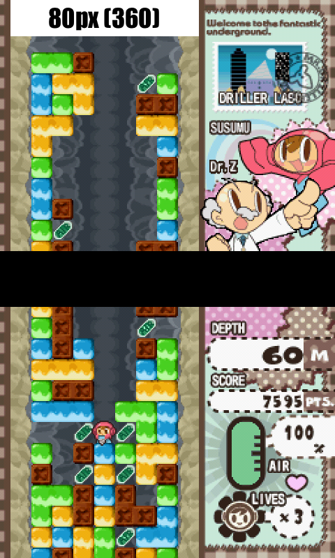
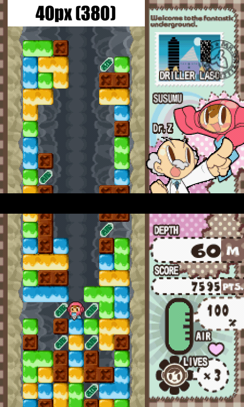
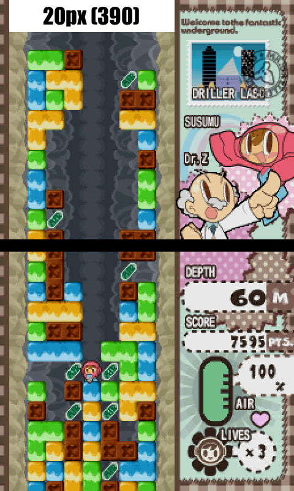
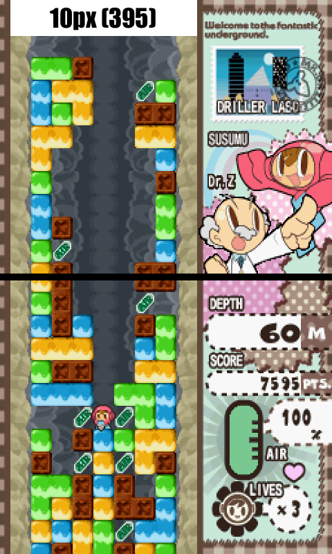

# DraStic screen layout presets for the MagicX Zero 40
This is a DraStic screen layout presets for the MagicX Zero 40.
Normally, DraStic only allows manual screen adjustments through its UI, but these presets were created by directly editing the binary layout file.  
Each preset includes a file named LC_2.dat. Place this file into the config folder inside your DraStic data directory. **(I strongly recommend backing up your config folder beforehand.)**

- 80px_h360 - 360×480 (default)  
  
- 40px_h380 - 380×480  
  
- 20px_h390 - 390×480  
  
- 10px_h395 - 395×480  
  
- 00px_h400 - 400×480  
  

These reduce the gap between the two screens and extend their height by ignoring the original aspect ratio. The number indicates the gap (in pixels) between the top and bottom screens. Smaller values mean a narrower gap, and 00px removes the gap entirely.
I tried improving visibility by sacrificing the aspect ratio, but even with a 0px gap (fully gapless), the screen height only increases to about 1.1× the original. So in practice, the improvement is fairly limited.  
If you want significantly larger screens, I recommend using a DEDICATED OS that allows expanding the overscan area.

- center_40px_40px - 360×480

This preset keeps the correct aspect ratio and centers both screens with a 40px margin at the top and bottom, resulting in a gapless layout in the middle.

# Notes
Games where the two screens visually connect will look great with the 00px gapless preset. However, in games like Metroid Prime Pinball, where gameplay depends on the physical gap between screens, the visuals may feel unnatural.
I find the 20px preset to be the best balance between visuals and gameplay. It also allows the background image (center.png) to display the “Nintendo DS” logo at its maximum usable size within the gap.

Interestingly, on my unit, the default layout had a center gap of only 79px instead of 80px, causing the bottom screen to be rendered at 359×480 (missing 1 pixel). I’m not sure whether this is a bug or intentional. It’s possible that the lower screen isn’t set to the correct aspect ratio in its factory default settings.  
I’ve also included several correctly sized variations of center.png. You can choose any color you like (the default is center_black.png). Just rename your preferred file to center.png and place it in the backgrounds folder inside your DraStic directory.

